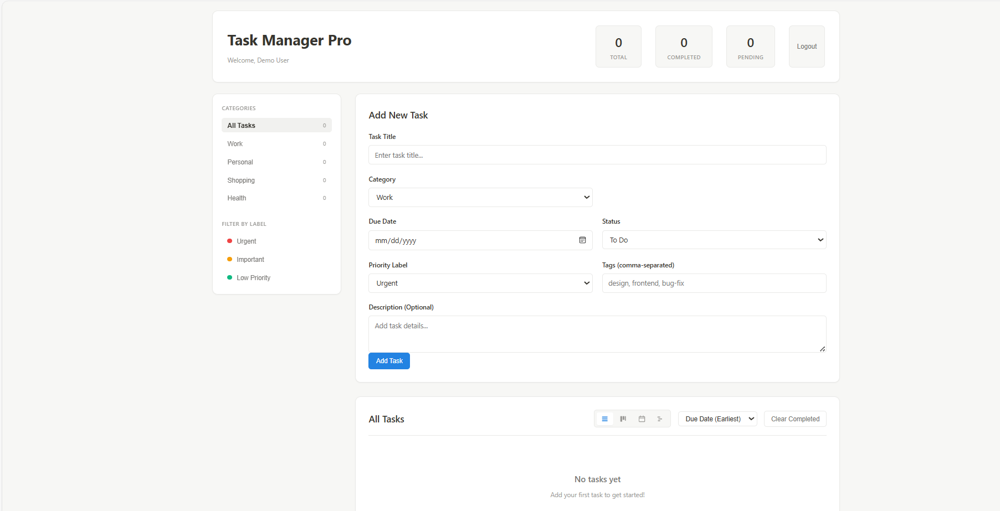

# Task Manager Pro

> A powerful, **Notion-inspired** task management application built with **vanilla JavaScript**. Features multiple database views, drag-and-drop, an AI assistant, and a clean, modern UI.

[](https://opensource.org/licenses/MIT)
[](https://developer.mozilla.org/en-US/docs/Web/JavaScript)
[](https://github.com/yourusername/task-manager-pro)
[](http://makeapullrequest.com)
[](https://github.com/yourusername/task-manager-pro/stargazers)

**[Live Demo](https://yourusername.github.io/task-manager-pro)** | **[Quick Start](QUICK-START.md)** | **[Full Documentation](INDEX.md)**

---

## Key Features

Task Manager Pro is designed for speed, simplicity, and powerful organization.

| Feature | Description | Status |
| :--- | :--- | :--- |
| **4 Database Views** | Switch instantly between **List**, **Kanban**, **Calendar**, and **Timeline** perspectives. | Included |
| **AI Assistant** | Intelligent features for **quick task suggestions**, auto-prioritization, and workload analysis. | Included |
| **Drag & Drop** | Intuitively manage task status on the **Kanban Board** with native browser drag-and-drop. | Included |
| **Notion-Inspired UI** | Clean, professional design with curved boxes, subtle shadows, and a light theme. | Included |
| **Lightning Fast** | Built with **Zero Dependencies** using pure Vanilla JS for superior performance. | Included |
| **Privacy First** | **100% Offline**. All data is stored locally in your browser's **LocalStorage**—no server, no tracking. | Included |
| **Fully Responsive** | Optimized experience for desktop, tablet, and mobile devices. | Included |

---

## Screenshots

|  |

### Task Views
| List View | Kanban Board | Calendar View |
| :---: | :---: | :---: |
| <br>*Detailed list with inline actions* | <br>*Drag tasks to change status* | <br>*Tasks displayed on due dates* |

### Advanced Views
| Timeline View | AI Assistant | Login Page |
| :---: | :---: | :---: |
| <br>*Chronological progression* | <br>*Quick actions and insights* | <br>*Secure access point* |

---

## Quick Start

### Installation

Since this is a vanilla JavaScript application, no compilation or complex installation is required.

```bash
# Clone the repository
git clone [https://github.com/yourusername/task-manager-pro.git](https://github.com/yourusername/task-manager-pro.git)

# Navigate to the project directory
cd task-manager-pro

# Open the main file in your web browser
open task-manager.html 
# (Use 'start task-manager.html' on Windows Command Prompt/PowerShell)
